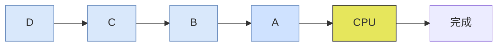

主要有4个经典的作业调度算法：先来先服务（FCFS）按提交顺序执行，短作业优先（SJF）优化平均等待时间，最高响应比优先（HRRN）通过(等待时间+运行时间)/运行时间的公式平衡任务权重，轮转法（Round Robin）采用时间片轮换调度。更多调度背景可参考 [[无涯/计算机科学/计算机操作系统/进程/进程管理#进程调度算法|进程管理 - 调度算法]]。

---
## 先来先服务（FCFS）

最简单的一个调度算法，就是非抢占式的**先来先服务（_First Come First Severd, FCFS_）算法**。

<small>FCFS 调度算法</small>

顾名思义，先来后到，**每次从就绪队列选择最先进入队列的进程，然后一直运行，直到进程退出或被阻塞，才会继续从队列中选择第一个进程接着运行。**

---
## 短作业优先（SJF）

**最短作业优先（_Shortest Job First, SJF_）调度算法**同样也是顾名思义，它会**优先选择运行时间最短的进程来运行**，这有助于提高系统的吞吐量。

<small>SJF 调度算法</small>

这显然对长作业不利，很容易造成一种极端现象。

比如，一个长作业在就绪队列等待运行，而这个就绪队列有非常多的短作业，那么就会使得长作业不断的往后推，周转时间变长，致使长作业长期不会被运行。

---
## 最高响应比优先（HRRN）

**高响应比优先 （_Highest Response Ratio Next, HRRN_）调度算法**主要是权衡了短作业和长作业。

**每次进行进程调度时，先计算「响应比优先级」，然后把「响应比优先级」最高的进程投入运行**，「响应比优先级」的计算公式：
$$
响应比 = \frac{{等待时间 + 要求服务时间}}{要求服务时间} = 1 + \frac{等待时间}{要求服务时间}
$$

从上面的公式，可以发现：

- 如果两个进程的「等待时间」相同时，「要求的服务时间」越短，「响应比」就越高，这样短作业的进程容易被选中运行；
- 如果两个进程「要求的服务时间」相同时，「等待时间」越长，「响应比」就越高，这就兼顾到了长作业进程，因为进程的响应比可以随时间等待的增加而提高，当其等待时间足够长时，其响应比便可以升到很高，从而获得运行的机会；

---
## 轮转法（Round Robin）

最古老、最简单、最公平且使用最广的算法就是**时间片轮转（_Round Robin, RR_）调度算法**。  

<small>RR 调度算法</small>

**每个进程被分配一个时间段，称为时间片（_Quantum_），即允许该进程在该时间段中运行。**

- 如果时间片用完，进程还在运行，那么将会把此进程从 CPU 释放出来，并把 CPU 分配另外一个进程；
- 如果该进程在时间片结束前阻塞或结束，则 CPU 立即进行切换；

另外，时间片的长度就是一个很关键的点：

- 如果时间片设得太短会导致过多的进程上下文切换，降低了 CPU 效率；
- 如果设得太长又可能引起对短作业进程的响应时间变长。

---
## 最高优先级调度算法（HPF）

前面的「时间片轮转算法」做了个假设，即让所有的进程同等重要，也不偏袒谁，大家的运行时间都一样。

但是，对于多用户计算机系统就有不同的看法了，它们希望调度是有优先级的，即希望调度程序能**从就绪队列中选择最高优先级的进程进行运行，这称为最高优先级（_Highest Priority First，HPF_）调度算法**。

进程的优先级可以分为，静态优先级或动态优先级：

- 静态优先级：创建进程时候，就已经确定了优先级了，然后整个运行时间优先级都不会变化；
- 动态优先级：根据进程的动态变化调整优先级，比如如果进程运行时间增加，则降低其优先级，如果进程等待时间（就绪队列的等待时间）增加，则升高其优先级，也就是**随着时间的推移增加等待进程的优先级**。

该算法也有两种处理优先级高的方法，非抢占式和抢占式：

- 非抢占式：当就绪队列中出现优先级高的进程，运行完当前进程，再选择优先级高的进程。
- 抢占式：当就绪队列中出现优先级高的进程，当前进程挂起，调度优先级高的进程运行。

但是依然有缺点，可能会导致低优先级的进程永远不会运行。

---
## 多级反馈队列调度算法（MFQ）

**多级反馈队列（_Multilevel Feedback Queue_）调度算法**是「时间片轮转算法」和「最高优先级算法」的综合和发展。

顾名思义：

- 「多级」表示有多个队列，每个队列优先级从高到低，同时优先级越高时间片越短。
- 「反馈」表示如果有新的进程加入优先级高的队列时，立刻停止当前正在运行的进程，转而去运行优先级高的队列；

<small>多级反馈队列</small>

来看看，它是如何工作的：

- 设置了多个队列，赋予每个队列不同的优先级，每个**队列优先级从高到低**，同时**优先级越高时间片越短**；
- 新的进程会被放入到第一级队列的末尾，按先来先服务的原则排队等待被调度，如果在第一级队列规定的时间片没运行完成，则将其转入到第二级队列的末尾，以此类推，直至完成；
- 当较高优先级的队列为空，才调度较低优先级的队列中的进程运行。如果进程运行时，有新进程进入较高优先级的队列，则停止当前运行的进程并将其移入到原队列末尾，接着让较高优先级的进程运行；

可以发现，对于短作业可能可以在第一级队列很快被处理完。对于长作业，如果在第一级队列处理不完，可以移入下次队列等待被执行，虽然等待的时间变长了，但是运行时间也会更长了，所以该算法很好的**兼顾了长短作业，同时有较好的响应时间。**